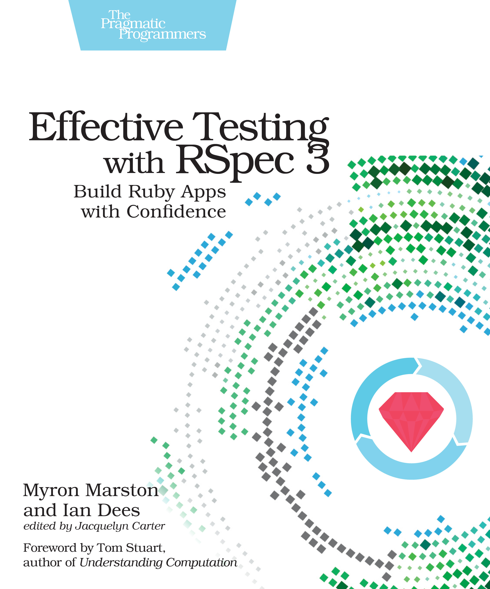

# RSpec
My works related to RSpec, a Domain Specific Language (DSL) testing tool written in Ruby to test Ruby code.

## Table of Contents
1. [Introduction.](#introduction)
2. [Official references websites.](#references)
3. [RSpec developers.](#developers)
4. [RSpec books.](#books)
5. [GitHub notes.](#github)
6. [GitHub repository calculation.](#calculation)

<a name="introduction"></a>
## 1. Introduction.
 
RSpec is a 'Domain Specific Language' (DSL) testing tool written in Ruby to test Ruby code. It is a behavior-driven development (BDD) framework which is extensively used in production applications. The basic idea behind this concept is that of Test Driven Development (TDD) where the tests are written first and the development is based on writing just enough code that will fulfill those tests followed by refactoring. It contains its own mocking framework that is fully integrated into the framework based upon JMock. The simplicity in the RSpec syntax makes it one of the popular testing tools for Ruby applications. The RSpec tool can be used by installing the rspec gem which consists of 3 other gems namely rspec-core, rspec-expectation and rspec-mock.
<br /><br />
RSpec was started as an experiment by Steven Baker in 2005 along with his team members Dave Astels, Aslak Hellesøy and David Chelimsky. David Chelimsky was responsible for developing the RSpec-Rails which facilitated the integration with Ruby on Rails. The initial release i.e. RSpec 1.0 came out in May 2007 which contained many prime features of RSpec which are being included in the latest releases also. However, due to some technical issues such as testing speed, it was discontinued later. The third version of RSpec i.e. the RSpec 3 was released in July 2014 which had many new features like verify doubles, composable matchers and many more. The latest version of the RSpec currently available is RSpec 3.7.

<a name="references"></a>
## 2. Official references websites. 
RSpec official website : https://rspec.info <br />
RSpec official documentation : https://rspec.info/documentation/ <br />
RSpec official GitHub page : https://github.com/rspec/rspec-rails <br />

**_RSpec questions and answers_** <br />
Stack Overflow questions and answers website : https://stackoverflow.com <br />

**_RSpec questions and answers by Stack Overflow_** <br />
[ draft ]

**_RSpec related articles_** <br />
Project: RSpec Expectations 3-9 by Relish : https://relishapp.com/rspec/rspec-expectations/docs/built-in-matchers <br />
What Is Automation Testing (Ultimate Guide To Start Test Automation) by Software Testing Help : https://www.softwaretestinghelp.com/automation-testing-tutorial-1/ <br />

<a name="developers"></a>
## 3. RSpec developers.
Aslak Hellesøy : https://github.com/aslakhellesoy, https://twitter.com/aslak_hellesoy <br />
Dave Astels : https://github.com/dastels, https://twitter.com/dastels <br />
David Chelimsky : https://github.com/dchelimsky, https://twitter.com/dchelimsky <br />
Ian Dees : https://github.com/iandees <br />
Myron Marston : https://github.com/myronmarston, https://twitter.com/myronmarston <br />

<a name="books"></a>
## 4. RSpec books.
**Effective Testing with RSpec 3 Build Ruby Apps with Confidence** by **_Myron Marston_** and **_Ian Dees_**, edited by **_Jacquelyn Carter_**
<br /><br />
 
 
<a name="github"></a>
## 5. GitHub notes.
Clone the current GitHub remote repository contents into local machine.
```
$ git clone https://github.com/syakirharis25/RSpec.git
$ cd RSpec/
$ git remote -v
$ git status
```

<a name="calculation"></a>
## 6. GitHub repository calculation.
```
draft
```
Refer to : https://github.com/syakirharis25/cloc
